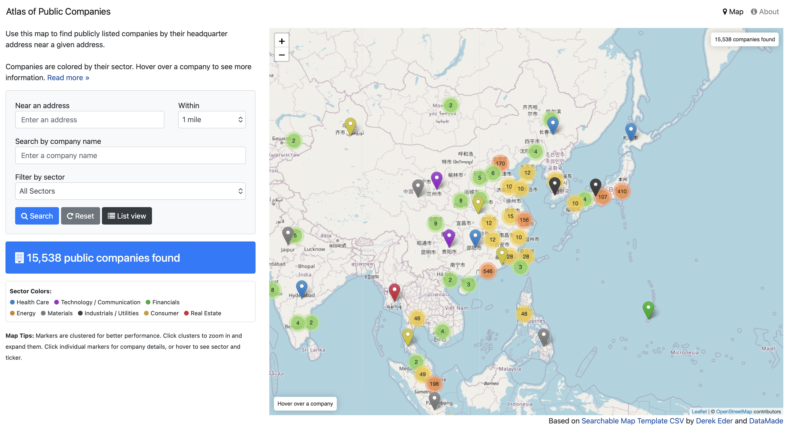

# 🗺️ Atlas of Public Companies

An interactive, searchable map of publicly traded companies worldwide, visualizing thousands of company headquarters with real-time filtering by location, sector, and company name.



## 🌟 Features

- **🔍 Location Search**: Find companies near any address with customizable radius (from 2 blocks to 1000 miles)
- **📊 Sector Filtering**: Color-coded markers by industry sector (Health Care, Technology, Energy, etc.)
- **🏢 Company Search**: Search by company name with instant filtering
- **📍 Smart Clustering**: Automatically groups nearby markers for better performance with 15,000+ data points
- **💡 Interactive Details**: Hover for quick info, click for full company details including description, address, and website
- **📱 Responsive Design**: Works seamlessly on desktop and mobile devices
- **🎨 Visual Sectors**: Color-coded pins show sector at a glance:
  - 🔵 Health Care
  - 🟣 Technology / Communication
  - 🟢 Financials
  - 🟠 Energy
  - ⚪ Materials
  - ⚫ Industrials / Utilities
  - 🟡 Consumer
  - 🔴 Real Estate

## 🚀 Live Demo

[View Live Demo](https://jkvyff.github.io/atlas-of-public-companies/) 

## 📊 Data

The map includes data on **15,000+ public companies** sourced from:
- [FinanceDatabase](https://github.com/JerBouma/FinanceDatabase) - Company information and sectors
- [yfinance](https://github.com/ranaroussi/yfinance) - Detailed company profiles and addresses
- Geocoding via [Nominatim](https://nominatim.org/) (OpenStreetMap) and optionally [Google Maps Geocoding API](https://developers.google.com/maps/documentation/geocoding)

**Data freshness**: Last updated October 2025

## 🛠️ Tech Stack

- **Mapping**: [Leaflet.js](https://leafletjs.com/) with OpenStreetMap tiles
- **Clustering**: [Leaflet.markercluster](https://github.com/Leaflet/Leaflet.markercluster) for performance with large datasets
- **Spatial Analysis**: [Turf.js](https://turfjs.org/) for radius-based filtering
- **Frontend**: Bootstrap 4, jQuery, EJS templating
- **Data Format**: GeoJSON
- **Data Pipeline**: Python scripts with geopy, yfinance, and FinanceDatabase

## 📖 How to Use

1. **Browse the Map**: Zoom and pan to explore companies worldwide
2. **Search by Location**: Enter an address and select a radius to find nearby companies
3. **Search by Name**: Type a company name to filter results instantly
4. **Filter by Sector**: Use the sector dropdown to show only specific industries
5. **View Details**: Click any marker for detailed company information
6. **Switch Views**: Toggle between map and list view for different perspectives

## 💻 Local Development

### Prerequisites
- A modern web browser
- A local web server (Python, Node.js, or any HTTP server)

### Quick Start

1. **Clone the repository**
   ```bash
   git clone https://github.com/jkvyff/atlas-of-public-companies.git
   cd atlas-of-public-companies
   ```

2. **Start a local server**
   
   Using Node.js (requires http-server):
   ```bash
   # First install http-server globally (one-time setup)
   npm install -g http-server
   
   # Then start the server
   http-server . -c-1
   ```
   
   Or use npx (no installation needed):
   ```bash
   npx http-server . -c-1
   ```

   Using Python:
   ```bash
   python -m http.server 8000
   ```

3. **Open in browser**
   ```
   http://localhost:8000
   ```

## 🔄 Updating the Data

The project includes Python scripts to regenerate the company data from scratch:

### Step 1: Fetch Company Data
```bash
cd scripts
python fetch_company_data.py
```
This fetches company information from FinanceDatabase and yfinance.

### Step 2: Geocode Addresses
```bash
python geocode_addresses.py
```
This converts addresses to coordinates using the free Nominatim service.

### Step 3: Retry Failed Geocodes (Optional)
```bash
export GOOGLE_MAPS_API_KEY='your-key-here'
python geocode_with_google.py
```
This retries failed geocodes using Google Maps API for better accuracy.

See [scripts/README.md](scripts/README.md) for detailed documentation.


### Modify Sector Colors
Edit the `getIcon()` function in `js/searchable_map_lib.js` to customize sector-to-color mappings.

### Adjust Clustering
In `js/map.js`, modify clustering settings:
```javascript
useMarkerClustering: true,  // Enable/disable clustering
```

In `js/searchable_map_lib.js`, adjust cluster radius:
```javascript
maxClusterRadius: 25  // Smaller = more clusters
```

### Update Map Center
Change the default map view in `js/map.js`:
```javascript
map_centroid: [37.3541, -121.9552],  // [latitude, longitude]
defaultZoom: 3
```

## 📝 Data Format

The map expects GeoJSON with this structure:

```json
{
  "type": "FeatureCollection",
  "features": [
    {
      "type": "Feature",
      "geometry": {
        "type": "Point",
        "coordinates": [longitude, latitude]
      },
      "properties": {
        "Company Name": "Example Corp",
        "Ticker": "EXMP",
        "Sector": "Technology",
        "Industry-Group": "Software & Services",
        "Industry": "Software",
        "Description": "Company description...",
        "Address": "Full address string",
        "URL": "https://example.com"
      }
    }
  ]
}
```

## 🙏 Credits & Acknowledgments

- **Original Template**: [Searchable Map Template](https://github.com/datamade/searchable-map-template-csv) by [DataMade](https://datamade.us/)
- **Data Sources**: [FinanceDatabase](https://github.com/JerBouma/FinanceDatabase), [yfinance](https://github.com/ranaroussi/yfinance)
- **Mapping**: [Leaflet](https://leafletjs.com/), [OpenStreetMap](https://www.openstreetmap.org/)
- **Geocoding**: [Nominatim](https://nominatim.org/), [Google Maps API](https://developers.google.com/maps/documentation/geocoding)

## 📄 License

This project is licensed under the MIT License - see the [LICENSE](LICENSE) file for details.

## 🤝 Contributing

Contributions are welcome! Please feel free to submit a Pull Request. Some ideas:

- Add more data sources or companies
- Improve geocoding accuracy
- Add additional filters (market cap, founded date, etc.)
- Enhance mobile responsiveness
- Add export functionality

## 💡 The Story Behind This Project

### The Original Atlas

The original **Atlas of Public Stocks** was created by Miguel A. Barbosa to help investors find publicly traded companies near specific locations:

> "Last year I was planning an investment trip to Munich, Germany and struggled to identify local public companies. I created this website to help investors facing similar situations. I hope you find it useful." - Miguel A. Barbosa

### Rediscovery & Recreation

This project is a recreation of that original Atlas, which went offline when Google shut down Fusion Tables in 2019. The journey to rebuild it:

1. **Discovery**: Saw [Michael Fritzell's tweet](https://twitter.com/MikeFritzell/status/1844166649668890755) lamenting the loss: *"Still mourning since the day the Atlas of Publicly Listed Stocks went offline."*

2. **Archaeological Research**: The Wayback Machine version didn't work, but I found:
   - A [2013 blog post on Maps Mania](https://googlemapsmania.blogspot.com/2013/05/a-google-map-of-public-stocks.html) describing its features
   - A [video walkthrough by the original creator](https://www.youtube.com/watch?v=-1kQ-C49ExU) showing the interface and data

3. **Rebuilding with Open Data**: The original likely used Bloomberg data. This version uses free, open-source alternatives (FinanceDatabase, yfinance) to make it accessible and forkable by anyone.

The goal: Recreate a useful tool that investors missed, using open-source technology and data, so it can never truly disappear again.

## 📧 Contact

Created by Jens Kristian Vyff - feel free to reach out with questions or suggestions!
